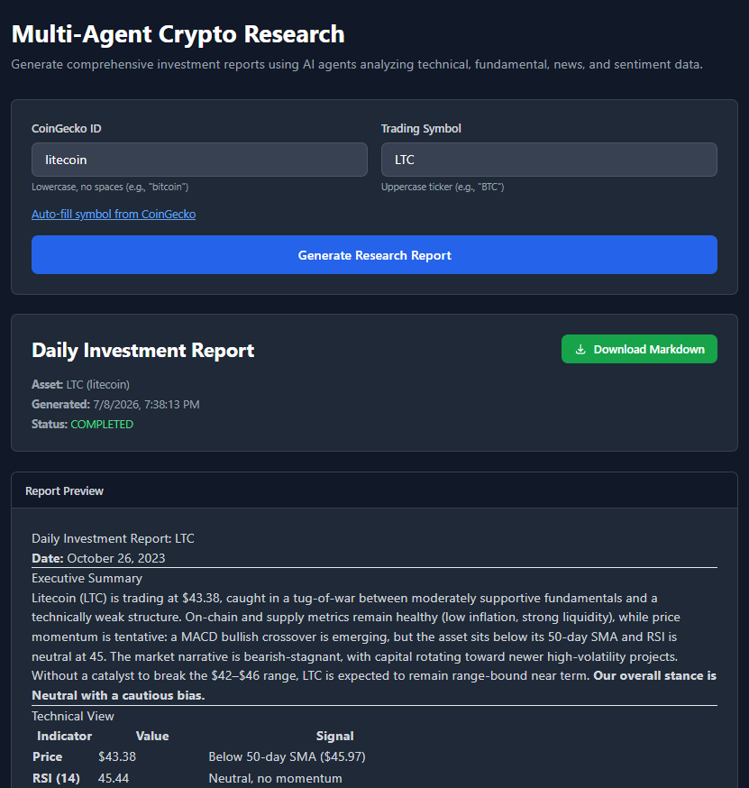

# 🤖 Multi-Agent Crypto Research Assistant


A production-grade, concurrent Multi-Agent system that generates comprehensive, hedge-fund-style cryptocurrency investment reports. It utilizes specialized AI agents to analyze technical indicators, on-chain fundamentals, real-time news, and market sentiment simultaneously.

🌐 **Live Demo:** [agents.adnanrp.com](https://agents.adnanrp.com)

---

## 🌟 Key Features

- **🔄 Concurrent Execution:** Utilizes Python's `asyncio.gather()` to run 4 specialized agents simultaneously, reducing data-gathering latency by ~75% compared to sequential execution.
- **🧠 Specialized Worker Agents:** 
  - **Technical Agent:** Calculates RSI, MACD, and SMAs via `yfinance` to determine trend momentum.
  - **Market Agent:** Analyzes liquidity, volume-to-market-cap ratios, and tokenomics via CoinGecko.
  - **News Agent:** Aggregates live headlines via GNews.io to identify macro catalysts.
  - **Sentiment Agent:** Gauges retail psychology and price-action sentiment.
- **🛡️ Semantic Guardrails:** Implements automated retry logic and strict system prompts to prevent LLM "context overload" and stop the model from falling back into generic chatbot greetings.
- **📝 Coordinator Synthesis:** A central Hub agent reads the populated shared state and synthesizes a structured, risk-aware Markdown investment report.
- **🎨 Professional SaaS Frontend:** A beautiful, responsive dark-mode UI built with Jinja2 and Tailwind CSS, featuring auto-fill symbol lookup and one-click Markdown downloads.

---

## 🏗️ System Architecture (Hub & Spoke)

```text
                      [ Frontend UI / Swagger ]
                               │
                               ▼
                      ┌────────────────────┐
                      │   FastAPI Router   │
                      └─────────┬──────────┘
                                │
                      ┌─────────▼──────────┐
                      │    Orchestrator    │ <── (Shared Pydantic State)
                      │ (asyncio.gather)   │
                      └─────────┬──────────┘
                                │ (Concurrent Execution)
        ┌───────────────┬───────┴───────┬───────────────┐
        ▼               ▼               ▼               ▼
┌──────────────┐ ┌──────────────┐ ┌──────────────┐ ┌──────────────┐
│ Tech Agent   │ │ Market Agent │ │  News Agent  │ │ Sentiment    │
│ (yfinance)   │ │ (CoinGecko)  │ │ (GNews API)  │ │ Agent        │
└──────┬───────┘ └──────┬───────┘ └──────┬───────┘ └──────┬───────┘
       │                │                │                │
       └────────────────┴────────────────┴────────────────┘
                                │
                      ┌─────────▼──────────┐
                      │ Coordinator Agent  │
                      │ (Synthesizes Final │
                      │  Markdown Report)  │
                      └────────────────────┘
```

---

## 🖼️ Screenshots

### 🎨 Interactive SaaS Frontend


---

## 🛠️ Tech Stack

| Category | Technology |
| :--- | :--- |
| **Backend Framework** | FastAPI, Uvicorn, Gunicorn |
| **AI / LLM** | DeepSeek API (OpenAI SDK compatible) |
| **Concurrency** | Python `asyncio`, `httpx` (Async HTTP) |
| **Data Tools** | `yfinance`, `pandas`, `ta` (Technical Analysis) |
| **External APIs** | CoinGecko (Market Data), GNews.io (Live News) |
| **Frontend / UI** | Jinja2, Tailwind CSS, Marked.js (Markdown rendering) |
| **DevOps / Infra** | Docker, Dokploy, Traefik (SSL/Reverse Proxy) |

---

## 🧠 Engineering Highlights & Decisions

1. **Why `asyncio.gather()` instead of LangGraph/CrewAI?**
   While frameworks like LangGraph are popular, building a custom Orchestrator using native `asyncio` provides granular control over execution flow, keeps the Docker image incredibly lightweight, and eliminates the overhead of complex state machines for a straightforward Map-Reduce workflow.
2. **Why limit the News Agent to 10 articles?**
   LLMs suffer from the "Lost in the Middle" attention bottleneck. Feeding an LLM 50+ articles causes it to hallucinate or ignore the middle data. Limiting to 10 articles keeps the context window optimized for high-quality reasoning and minimizes token costs.
3. **What are Semantic Guardrails?**
   During testing, feeding raw JSON news arrays sometimes caused the LLM to forget its persona and output generic chatbot greetings (RLHF fallback). I implemented a Python-based semantic guardrail that detects these trigger phrases and automatically retries the LLM call with a stricter, zero-shot prompt to ensure 100% reliable output.

---

## 🚀 Local Development Setup

### Prerequisites
- Python 3.14+
- DeepSeek API Key
- GNews.io API Key (Free tier works perfectly)

### 1. Clone and Install
```bash
git clone https://github.com/AdnanRahmanpoor/crypto-research-agent.git
cd crypto-research-agent
python -m venv venv
source venv/bin/activate  # On Windows: venv\Scripts\activate
pip install -r requirements.txt
```

### 2. Configure Environment
Create a `.env` file in the root directory:
```env
APP_NAME="Crypto Research Agent"
DEEPSEEK_API_KEY="sk-your-key-here"
DEEPSEEK_BASE_URL="https://api.deepseek.com"
DEEPSEEK_MODEL="deepseek-chat"
GNEWS_API_KEY="your_gnews_key_here"
```

### 3. Start the Server
```bash
uvicorn app.main:app --reload
```
Visit **http://127.0.0.1:8000** for the visual UI, or **http://127.0.0.1:8000/docs** for the interactive Swagger API.

---

## 🐳 Production Deployment (Docker)

This project is fully containerized and deployed via Dokploy for zero-downtime CI/CD.

**Build and run locally via Docker:**
```bash
docker build -t crypto-research-agent .
docker run -d -p 8000:8000 --env-file .env crypto-research-agent
```

---

## 📄 License

Distributed under the MIT License. See `LICENSE` for more information.
